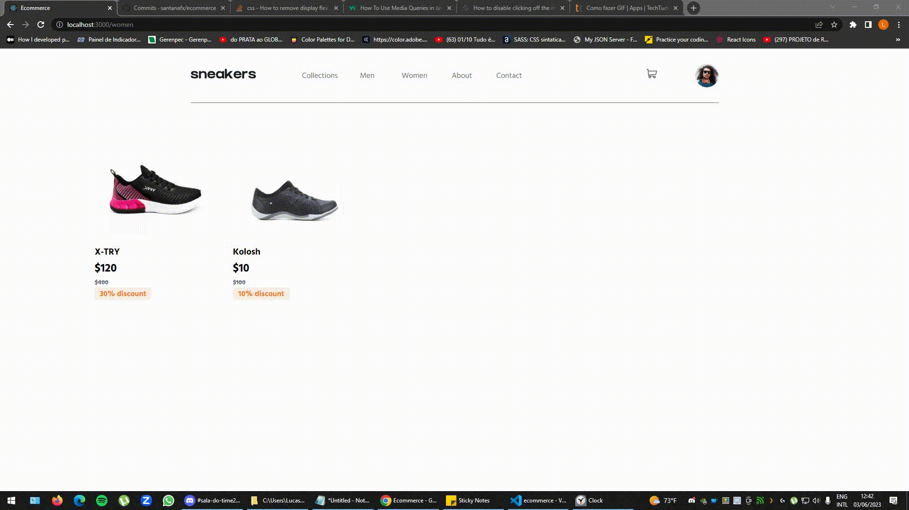
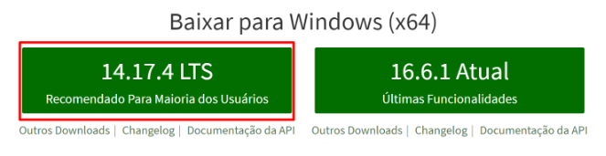
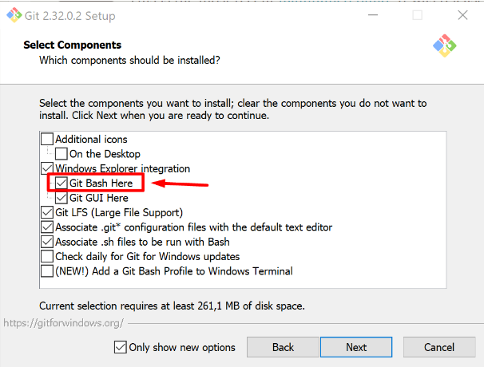
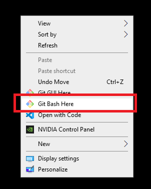
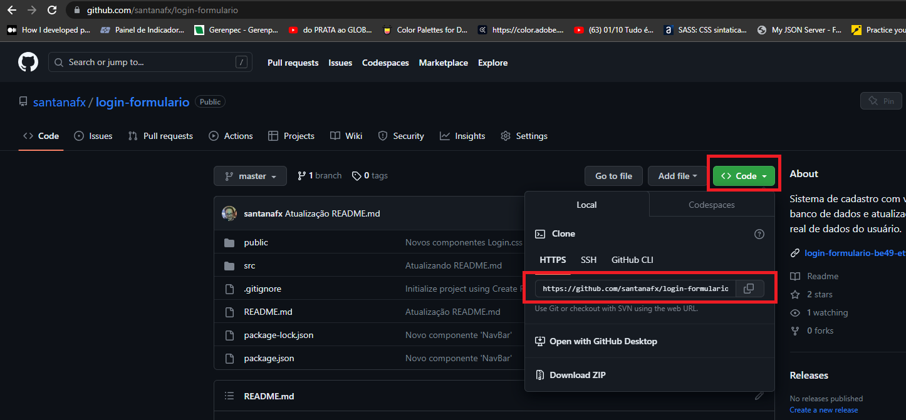
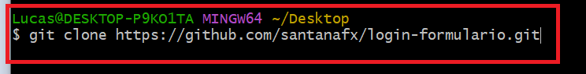
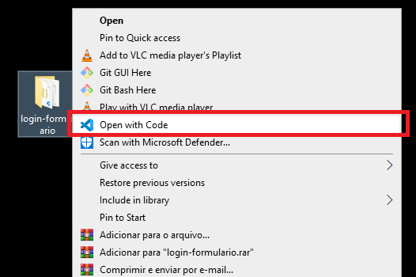
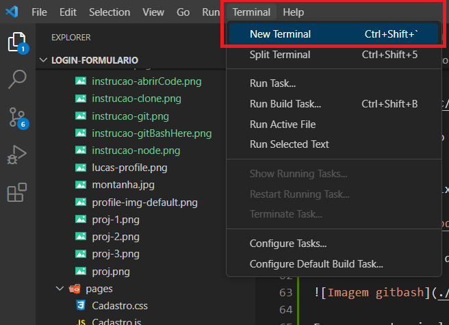
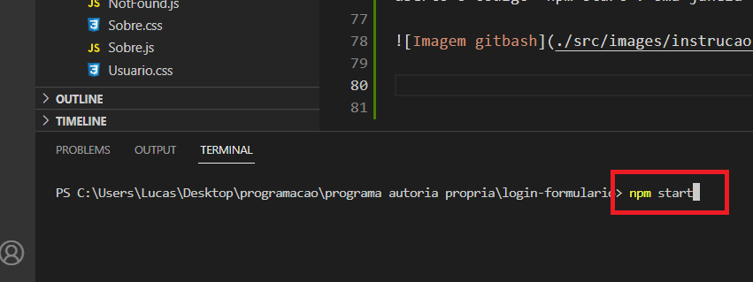

  <image
  src="https://img.shields.io/github/languages/count/santanafx/image-handler"
  />
  <image
  src="https://img.shields.io/github/languages/top/santanafx/image-handler"
  />
  <image
  src="https://img.shields.io/github/last-commit/santanafx/image-handler"
  />
  <image
  src="https://img.shields.io/github/watchers/santanafx/image-handler?style=social"
  />

# 📋 Índice

- [Sobre o projeto](#id01)
- [Acesse](#id02)
- [Acesse](#id03)
- [Imagens do projeto](#id04)
- [Linguagens utilizadas](#id05)
- [Como instalar](#id06)
- [Sobre o autor](#id07)

# 🚀 Sobre o projeto 

O projeto consistiu em criar uma loja virtual. Quando a página é acessada, todos os itens das coleções "Men" e "Women" são mostrados na página inicial (Collections). Os itens há venda são todos renderizados com informações coletadas de um banco de dados que contém todas as informações do protudo, como, preço, desconto, imagens do produto, categoria, coleção, etc. O menu de navegação fornece ao usuário opções de navegação para filtrar os itens de acordo com sua vontade. Quando um item é selecionado, é aberto a página com informações do produto, preço, desconto e funcionalidade de adicionar um determinado número de itens no carrinho de comprar. Os itens no carrinho de compras são atualizados dinâmicamente no icone de carrinho do menu superior. É possível clicar em cima da imagem do produto desejado no carrinho para ver todas as imagens do produto. 

## 🏆 Acesse 

<a href="https://login-formulario-be49-ett5j6s85-santanafx.vercel.app/">Acesse a aplicação clicando aqui</a>.

## ✔️ Objetivos 

  Os principais objetivos deste projeto foram:
  
  1- Desenvolver habilidades de CSS.
  2- Adquirir conhecimento de Javascript/React.
  3- Construir um menu lateral.
  4- Construir um modal.
  5- Construir interface de troca de imagem através de botões.
  6- Construir um carrinho de compras.
  7- Separar itens por categoria.
  8- Utilizar media query para atender requisitos de responsividade.
  9- Praticar o uso de hooks do react (useState,useEffect,useContext).

## ☑️ Imagens do projeto 

## 📝 Linguagens utilizadas

JavaScript | React | HTML | CSS

 
  
  
  
  

## 🛠 Como instalar

Para preparar o ambiente, precisaremos ter algumas coisas instaladas no computador, sendo elas:

Node.js
<a href="https://nodejs.org/pt-br">Clique aqui para instalar o Node.js</a>.

Para instalar o Node, clique no link e baixe a versão LTS (versão recomendada)
Para verificar se foi instalado corretamente, abra o terminal e escreva node -v ou node --version
alt text: site do Nodejs, com o botão da versão recomendada em foco por um quadrado vermelho!

Git
<a href="https://git-scm.com/download/windows">Clique aqui para instalar o Git</a>.

Caso não tenha um terminal de preferência, recomendo utilizar o git bash. Para instalá-lo, haverá uma opção durante a instalação do git para permitir instalar o git bash
alt text: imagem mostrando várias caixas selecionáveis. A caixa “Git Bash Here” está em evidência por um quadrado vermelho com uma seta apontada para ele

Para verificar se o git foi instalado corretamente, abra o terminal e escreva git --version
Visual Studio Code

Entre no link e baixe a versão de Windows.

<a href="https://code.visualstudio.com/download">Clique aqui para instalar o Visual Studio</a>.

Clique com o botão direito em algum local do computador e selecione a opção Git Bash Here.

Escreva no terminal o comando abaixo e no lugar de 'cole aqui' entre no projeto do GitHub e cole o link do projeto.

git clone 'cole aqui o link do projeto'

Uma pasta com o projeto desejado será adicionada a pasta em que foi escolhida.
Clique com o botão direito em cima da pasta e selecione "Abrir com Code"

Uma vez que o Visual studio estiver aberto com o projeto desejado, abra o terminal clicando no menu da aba superior e digite no terminal aberto o código "npm install" e logo em seguida digite "npm start". Uma janela do browser será aberta e o projeto será iniciado em seu computador.

## 😎 Sobre o autor

- Linkedin - [Lucas Santana Figueiredo](https://www.linkedin.com/in/lucas-santana-figueiredo/)
- GitHub - [santanafx](https://github.com/santanafx)
